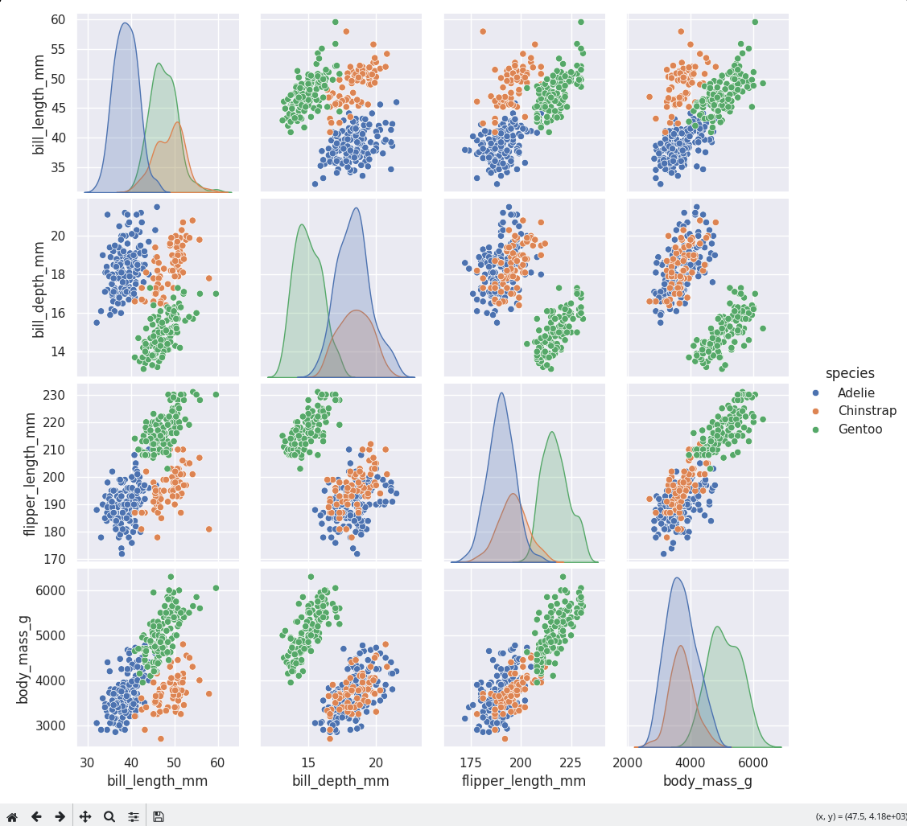

# Step 1 - Installing Python and Seaborn


## Installing Python
This section deals with installing Python for Windows/Linux. Click [here](#Stuff) to skip to the Python packages installation section

### Windows
To install Python on Windows, follow these steps:
1. Navigate to the [Python downloads page for Windows](https://www.python.org/downloads/windows/)
2. Select a Python 3 release. The minimum recommended version for this tutorial is Python 3.9.
3. Run the downloaded executable. Tick **Add python.exe to PATH** and click *Install Now*. You may close the window after it has installed
4. Check the installation by launching a cmd shell. You can open a cmd by typing ``cmd`` in Windows Search and clicking on the result. Type ``python --version``. You should not get any errors.

### Linux
1. Open a terminal and use the package manager of your Linux distribution to install Python 3. For example: 

Ubuntu:
```bash
sudo apt install python
```
Fedora:
```bash
sudo dnf install
```

## Installing Seaborn
### Windows
Open a cmd window like before and type ``pip install seaborn``
### Linux
Open a terminal and type ``pip install seaborn``. If pip is not installed, you may do so using the package manager of your distribution (example: ``sudo dnf install python3-pip``)

Installing seaborn should also install all other dependencies that we will need, so the install process is finished.

## Testing seaborn
To make sure everything went well, we will now run a test script. Create a new file with whatever name you wish and with ``.py`` as its extension. Open it up in your favourite text editor and type the following code:
```python
import seaborn as sns
import matplotlib.pyplot as plt

# Set the default theme
sns.set_theme()

# Load an example dataset
penguins = sns.load_dataset("penguins")

# Create a test plot
sns.pairplot(data=penguins, hue="species")

# Display the plot
plt.show()
```
Open a terminal and run the code by typing
```bash
python test.py
```
A new window should appear with something like this:
<p align="center"></p>

Everything went well? Great! In the next step we will tackle loading the dataset and preparing it for visualization.
