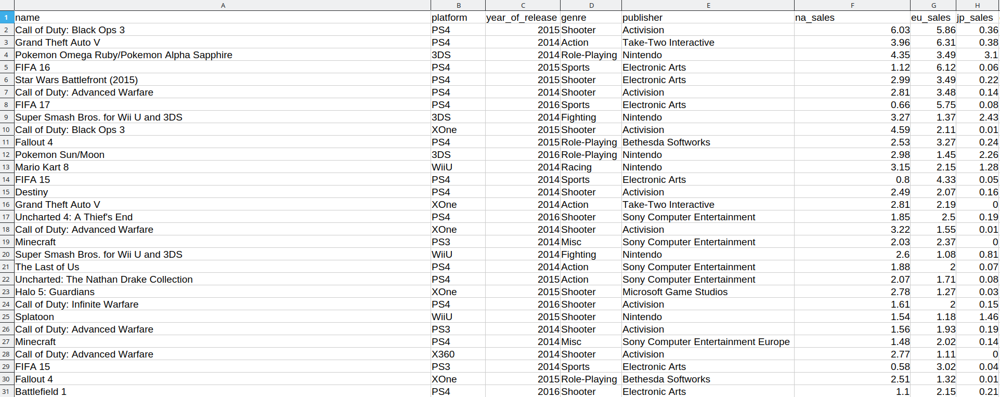
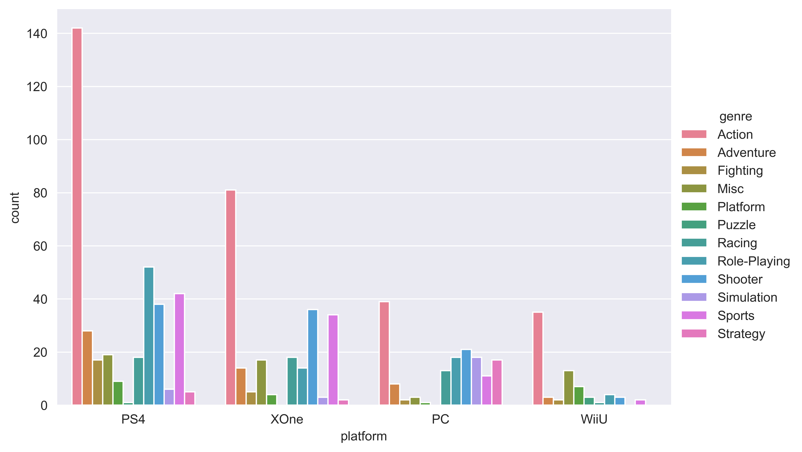

# Loading and preparing the dataset

Real-life data is messy. Sometimes we cannot work with datasets unless we have manually (or with a script) intervened to handle errors, missing or inconsistent data.

Fortunately, the dataset provided here is ready for us to use, no cleaning up needed.  Still, if you use a different dataset, you might have to do some cleaning up. This process is outside the scope of this lesson.

## Looking at the dataset
If we open up our .csv file in a Spreadsheet editor like Google Docs or Microsoft Excel, we notice that it's just a big table with over 1500 lines and 16 rows of text. 
<p align="center"></p>
<p align="center">Part of the .csv file opened as a spreadsheet</p>

The table perspective is just an interpretation of the program I opened the file in. In reality, the file itself is simple text file where each entry is separated by a comma, hence **CSV - Comma Separated Values**.
```
name,platform,year_of_release,genre,publisher,na_sales,eu_sales,jp_sales,other_sales,global_sales,critic_score,critic_count,user_score,user_count,developer,rating
Call of Duty: Black Ops 3,PS4,2015,Shooter,Activision,6.03,5.86,0.36,2.38,14.63,,,,,,
Grand Theft Auto V,PS4,2014,Action,Take-Two Interactive,3.96,6.31,0.38,1.97,12.61,97.0,66.0,8.3,2899.0,Rockstar North,M
```

## Loading the dataset in Python
Create a new Python script and write the following code:
```python
import csv

with open('dataset.csv') as dataset_file:
    # DictReader will convert the rows into dictionaries
    reader = csv.DictReader(dataset_file)

    for row in reader:
        print(row)
```
Running this code should print the entire contents of the dataset, row by row.

## Preparing the dataset
Let's look at the end result we are trying to archieve once more.
<p align="center"></p>

We can easily tell that not all of the data in the dataset was used to generate this bar chart. The columns that were used were ``platform`` and ``genre``. Regarding the ``platform`` field, only a subset of platforms are shown here (PS4, XOne, PC and WiiU).

Moreover, there is no ``count`` column in the dataset, but we see it in the chart. That means the ``count`` values were calculated based on the dataset information *without* explicitly being in the dataset.

To sum up, we have the following tasks here:
1. Filter dataset to only a subset of platforms: PS4, XOne, PC, WiiU and discard all others (like PS3, X30 etc.)
2. Discard all columns except ``platform`` and ``genre``
3. Calculate how many sales per platform by genre (``count``)
4. Create the final dataset that we send to seaborn

## [ADVANCED] Using pandas
The method presented above is very long and tedious because the data manipulation is done manually. There are plenty of ways to turn all that code into just a few lines, I will present one of them here.

[pandas](https://pandas.pydata.org/) is a data analysis and manipulation library for Python and it has some really powerful and useful functions that we can leverage, but they are a bit overwhelming for beginners.

Here is the code that does everything we did above, but using pandas. Please not that it's quite advanced and understanding it is not required.

```python
import pandas as pd

df = pd.read_csv('dataset.csv')

# Filter platforms
platform_filter = ['PS4', 'XOne', 'PC', 'WiiU']
filtered_df = df[df['platform'].isin(platform_filter)]

# Discard columns and add the new count field
final_df = filtered_df.groupby(['platform', 'genre']).size().reset_index(name='count')

# Use a Categorical to enforce a custom sorting order
final_df['platform'] = pd.Categorical(final_df['platform'], platform_filter)

# Sort by platform and genre
final_df = final_df.sort_values(by=['platform', 'genre'])
```

``df`` here stands for DataFrame, which is a pandas data structure that essentially represents a table. We can do all sorts of manipulations on the dataframe, like sort, filter and remove data.