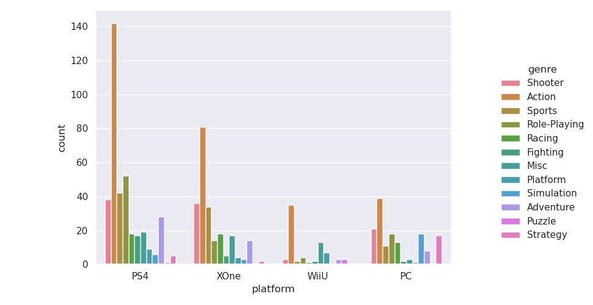
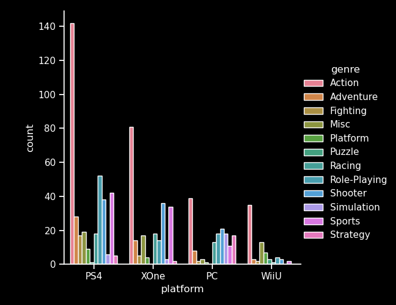
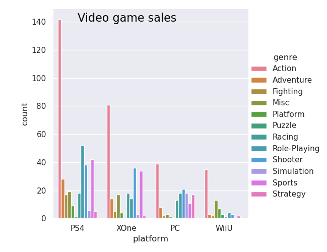

# Creating the bar chart with seaborn
Creating the bar chart is pretty straighforward now that we have successfully created the dataset we need.

In the same Python script that we used in the previous step, add the import for ``seaborn``, ``matplotlib.pyplot`` and ``pandas``.

```python
import csv
import os

import seaborn as sns
import matplotlib.pyplot as plt
import pandas as pd

def load_dataset():
    # Code from previous step
    # ...
```

## Converting dataset to pandas DataFrame
Internally, the seaborn library is built around the DataFrame structure of another library that we've discussed in the previous step: pandas.

However, we don't need to interact with pandas DataFrame for this tutorial, because pandas can easily convert an array of dictionaries to a DataFrame.

```python
dataset = load_dataset()
df = pd.DataFrame(dataset)
```

## Creating the bar chart
Once we have everything set up, creating a bar chart with seaborn is as simple as specifying which data goes on which axis: ``platform`` on the x axis, ``count`` on the y axis and ``genre`` on the "*hue*" axis. We call the ``catplot`` function (because a bar chart is a type of categorical plot) with the appropriate arguments.
```python
dataset = load_dataset()
df = pd.DataFrame(dataset)

sns.set_theme() 
sns.catplot(data=df, x='platform', y='count', hue='genre', kind='bar')

plt.show() # Display the chart
```
<p align="center"></p>

And that's all there is to it! We replicated the bar chart at the start of this lesson.

*Or did we...?*

## [BONUS] Sorting the dataset

If we look at our output and the chart at the start of the lesson, we see a few differences


Output             |  Reference
:-------------------------:|:-------------------------:
  |  

What can we do to ensure the order of the genres and the order of the platforms are exactly the same as in the reference?

<br><br>

```
        --- Try to solve this on your own first ---
```
<br><br>

Solution:   
The trick is to sort the dataset in a specific way. All PS4 entries are first, sorted alphabetically by genre, then all XOne entries, again sorted alphabetically by genre and so on. One way is to assign priorities to each platform in a sort with a custom sorting key. We use the priorities to sort, and if the priorities are identical (i.e. the same platform but different genres), we sort alphabetically by genre.

```python
def sort_key(game):
    platform_priority = {'PS4': 0, 'XOne': 1, 'PC': 2, 'WiiU': 3}
    return (platform_priority.get(game['platform'], 4), game['genre'])

# Sort the array using the custom sorting function
dataset = sorted(dataset, key=sort_key)
```

Using this sorted dataset will produce an identical bar chart to our reference.


## [BONUS] Customizing chart
Seaborn offers different ways to customize the aesthetics of your bar chart. You can read the official documentation regarding plot aesthetics by clicking [here](https://seaborn.pydata.org/tutorial/aesthetics.html), but here are a couple ideas:

- Changing style to "dark mode"
    ```python
    sns.set_style('ticks')
    plt.style.use("dark_background")
    sns.catplot(data=df, x='platform', y='count', hue='genre', kind='bar')
    plt.show()
    ```
    <p align="center"></p>
- Adding text
    ```python
    sns.catplot(data=df, x='platform', y='count', hue='genre', kind='bar')
    plt.text(x=0, y=140, s="Video game sales", fontsize=16, color="black")
    plt.show()
    ```
    <p align="center"></p>